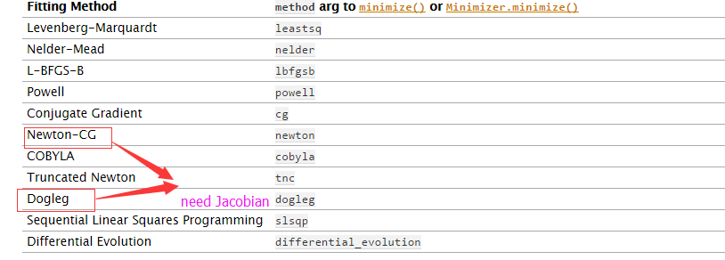

# CCPCR 荧光曲线拟合

### 论文

[PSO+: 基于粒子群结合其他迭代算法非线性
拟合热对流聚合酶连锁反应的荧光数据](http://www.hxyx.com/fileHXYY/PIC/swyxgcxzz/newcreate/swyxgcxzz-36-3-fuda_online.pdf)

## 这个源代码依赖库包括
> numpy 1.10.4
> scipy  0.16.1
> matplotlib 1.1.1rc
> limfit

#### 本程序运行在Ubuntu12.04 平台上

********

##### 主要包含下面几个主要python脚本文件

* pso_all.py(读取 荧光数据文件csv,并且采用评价函数指标有SSE,RMSE,Rscore,ajustRscore等为粒子群的适应函数,pso+LM ,pso+CG....)
* ---
* pso_only.py(读取 荧光数据文件csv,并且采用评价函数指标有SSE,RMSE,Rscore,ajustRscore等为粒子群的适应函数,只有pso算法)
* ----
* compare_pso.py主要是用一般的算法比如（Levenberg-Marquardt算法,Newton-CG算法等）这些算法容易陷入局部最优，所以对于初始解的选取特别的重要
*----
************
### usage
* python pso_only.py ./csvdata/file.csv RMSE(SSE,RScore,RMRS等) 
* ----
* python pso_all.py ./csvdata/file.csv RMSE leastsq(或是tnc 见下面截图)

* ----
* python compare_pso.py ./csvdata/file.csv leastsq initial_data(这个我这边初始化两个，其他参数由程序生成) 
* ----

*********************************
#### 其他

***********************************
**最后结果都存在./result/文件夹中**

